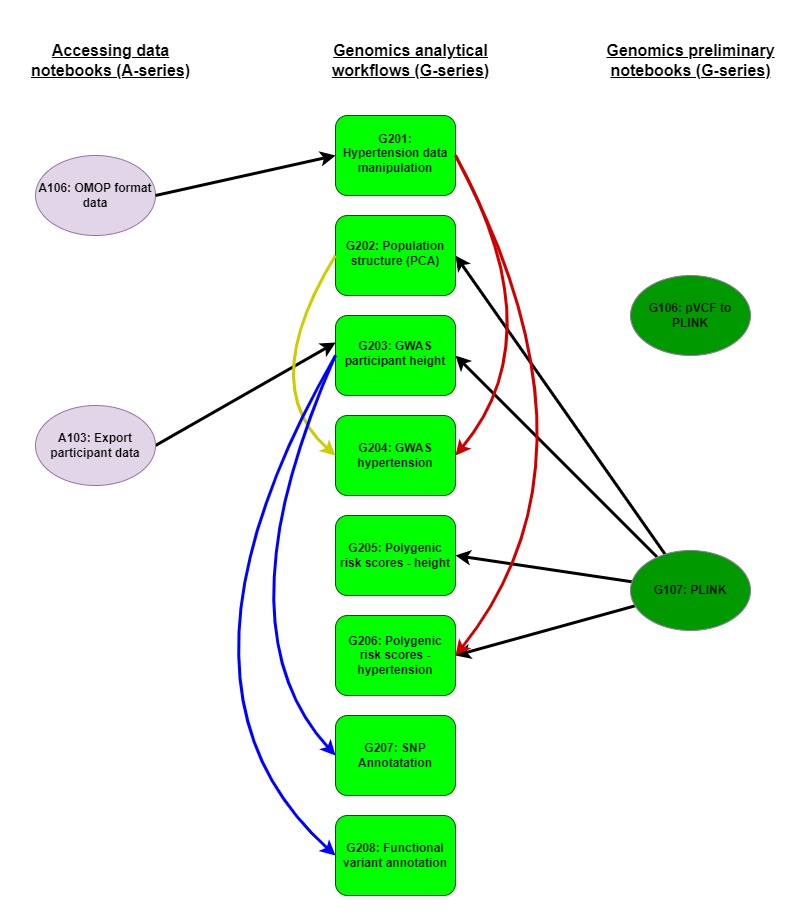

# Genomics on the UK Biobank Research Analyses Platform

The G-series (**Genomics**) notebooks found in this repository focus on performing genomics analytics workflows on the RAP. The notebooks running down the centre of figure 1 form the core repository of analytical workflows. As you run through them you will also create files required for subsequent workflows (purple and blue arrows; figure 1). Furthermore, a number of these analyses are contingent on data files created and uploaded to your RAP project in the A-series (**Accessing data**) notebooks (black arrows; figure 1). Figure 1 indicates which A-series notebooks are required to be run to create the requisite files for these analyses; e.g. the A-series notebook A103 is required to perform the G202 GWAS analysis. Finally, there are genomics-based preliminary notebooks (G101 and G102) contained in this repo that outline basic genomic data file handling methods with G102 also providing genomic input files (green arrows) for a number of the main analytical workflows (figure 1).

In order to initiate these notebooks on the RAP please see instructions at the bottom of this page.

These notebooks illustrate how to perform many standard analyses (e.g, GWAS, population genomics, functional annotation) that are typically employed in bioinformatic studies. Please note, notebook **G102**, a key component of many subsequent analyses, takes several hours to run as it processes the first eight chromosomes of the 200K joint call PLINK formatted files. It can be sped up to only process fewer files, e.g., the last three smaller chromosomes (20-22; the only downside to this is that occasional downstream analyses will not generate illustrative significant results). Please see comments in **G102** for instruction if you wish to change code for quicker file processing.

### 

### Please note

-   When working with phenotypic data a Spark cluster is often required (see *Table of Contents* for guidance)

-   Always terminate a kernel before starting a new notebook

- You need Tier 3 access (or Tier 11 or 12 for students and/or low-income countries) for genomic (WES or WGS) data sets.

### 

# Table of contents for Genomics workflows

**Genomics preliminary workflows**

G101 UKB pipeline pVCF to PLINK (language = Bash; instance = Single Node)

G102 Processing variant data using PLINK (Bash; Single Node)

G103 Retrieve participant data for Hail GWAS (Bash; Spark)

**Genomics analytical workflows**

G201 Population structure (PCA) ethnicity (R; Spark)

G202 GWAS participant height (R; Single Node)

G203 GWAS hypertension (R; Single Node)

G204 Polygenic risk scores of participant height (R; Single Node)

G205 Polygenic risk scores for hypertension (R; Single Node)

G206 Annotate SNPs from dbSNP and profile ontologies (R; Single Node)

G207 Functional annotations of variants (R; Single Node)

G208 GWAS in Hail (Python; Spark/Hail-VEP)

### 

# Python and R libraries

### The following Python libraries are required (guidance on installation found within Notebooks):

*scipy; dxdata; matplotlib.pyplot; numpy; openpyxl; os; pandas; seaborn*

### The following R libraries are required:

*BSgenome.Hsapiens.UCSC.hg38; GenomicRanges; SNPlocs.Hsapiens.dbSNP155.GRCh38; TxDb.Hsapiens.UCSC.hg38.knownGene; VariantAnnotation; VennDiagram; arrow; bigparallelr; bigsnpr; dplyr; dxdata; ggplot2; gprofiler2; grid; hexbin; parallel; readr; readxl; reticulate; scales; skimr; tidyr; tidyverse*

# Preliminary notebook details

##

## G101 UKB pipeline pVCF to PLINK (Bash; Single Node)

**Scope:** This notebook shows how to interact with genomic data in bed/bim/bam format using PLINK 2.0. We will learn how to convert between PLINK 1.x and PLINK 2.x file formats, merge variants from different chromosomes into a single file and filter them based on variant completeness and mean allelic frequencies (MAF). Please note the extended runtime of this notebook and that no subsequent analyses are contingent on its outputted files.

**Notebook file:** G101_UKB-pipeline-pVCF-to-PLINK.ipynb

**Dependency**

-   **PLINK install**

**Run info:**

-   runtime: 4hrs

-   recommended instance: mem1_ssd1_v2_x16

-   estimated cost: £1.50

### 

## G102 Processing variant data using PLINK (Bash; Single Node)

Scope: This notebook shows how to interact with genomic data in bed/bim/bam format using PLINK 2.0. We will learn how to convert between PLINK 1.x and PLINK 2.x file formats, merge variants from different chromosomes into a single file and filter them based on variant completeness and mean allelic frequencies (MAF). This process filters and then merges all the chromosomes into one file. More filters, prior to merging will likely speed this process.

**Notebook file:** G102_Processing-variant-data-PLINK.ipynb

**Dependency**

-   **PLINK install**

**Run info:**

-   runtime: 12 hours

-   recommended instance: mem1_ssd1_v2_x16

-   estimated cost: £1.50

##

## G103 Retrieve participant data for Hail GWAS (Bash; Spark)

Scope: In this notebook, we access phenotypic data stored in the Spark database. [Notebook A103](https://github.com/UK-Biobank/UKB-RAP-Notebooks-Access/blob/main/JupyterNotebook_Python/A103_Export-participant-data_Python.ipynb) provides further details on retrieving participant data if needed.

**Notebook file:** G103_Retrieve_participant_data_for_Hail_GWAS.ipynb

**Dependency**

-   **A Spark instance**

**Run info:**

-   runtime: 10 mins

-   recommended instance: mem1_ssd1_v2_x8

-   estimated cost: £0.10

##

# Analytical notebook details

## 

## G201 Population structure (PCA) ethnicity (R; Spark)

**Scope:** This notebook show how to retrieve phenotype data, load genotype data and perform Principal Component Analysis (PCA) with packages bigstatsr and bigsnpr (PrivC), Aschard, and Blum 2017). Additionally, it demonstrates why pruning and removing long-range Linkage Disequilibrium (LD) are two important steps before computing PCs in order to capture population structure (Abdellaoui et al. 2013).

**Notebook file:** G201_Population-structure-PCA-ethnicity.ipynb

**Dependency:**

-   **A Spark instance**

<!-- -->

-   **G102** - files prefixed *maf_flt_8chroms\**

**Run info:**

-   runtime: 30min

-   recommended instance: mem1_ssd1_v2_x16

-   cost: £0.70

## G202 GWAS participant height (R; Single Node)

**Scope:** We will use phenotypes produced by notebook **A103**. This includes three sources of information about participant's high blood pressure status: self-reported, ICD10 diagnoses and systolic blood pressure cut-offs, as well as values of blood pressure measurement. The phenotype data file also includes the `eid` identifier column, which allows us to match the rows in the `phenotype` table to corresponding genotypes saved in PLINK format. We will use linear and logistic models required for GWAS analyses using `bigstatsr` and `bigsnpr` packages (PrivC), Aschard, and Blum 2017) in R.

**Notebook file:** G202_GWAS-participant-height.ipynb

**Dependency:**

-   **A103** - file *pheno_height_sex_age_500k.xlsx*

-   **G102** - *maf_flt_8chroms*\* prefixed files

**Run info:**

-   runtime: 30min

-   recommended instance: mem1_ssd1_v2_x16

-   cost: £0.70

## G203 GWAS hypertension (R; Single Node)

**Scope:** This notebook is a more advanced version of the GWAS workflow presented in notebook **G202**. We will use phenotypes produced by **A106** and ethnicity data derived from **G201**. This includes three sources of information about participant's high blood pressure status: self-reported, ICD10 diagnoses and systolic blood pressure cut-offs, as well as values of blood pressure measurement. We will also use we use the partial SVD (or PCA) of a Filebacked Big Matrix to calculate covariates representing the population structure for the GWAS model. The phenotype data file also includes the `eid` column, which allows us to match the rows in the `phenotype` table to corresponding genotypes saved in PLINK format. We will linear and logistic models required for GWAS analyses using `bigstatsr` and `bigsnpr` packages (PrivC), Aschard, and Blum 2017) in R.

**Notebook file:** G203_GWAS-hypertension.ipynb

**Dependency:**

-   **A106** - *pheno_data_hypertension.csv*

-   **G201** - *ethnicity_processed.csv*

**Run info:**

-   runtime: 1h

-   recommended instance: mem1_ssd1_v2_x16

-   estimated cost: £1.00

## G204 Polygenic risk scores of participant height (R; Single Node)

**Scope:** Polygenic scores are important tools for understanding complex genetic associations. In this notebook, we show how to derive polygenic scores based on summary statistics and a matrix of correlation between genetic variants. We will use R package `bigsnpr` that implements the LDpred2 method (<https://doi.org/10.1093/bioinformatics/btaa1029>). As input, we will use the same data as in the previous GWAS examples. This notebook focus on a linear model using participant height data. In the next one, we will use a more complex example with logistic regression and blood pressure data.

**Notebook file:** G204_Polygenic-risk-scores-participant-height.ipynb

**Dependency:**

-   **G102** - *maf_flt_8chroms*\* prefixed files

**Run info:**

-   runtime: 1h

-   recommended instance: mem1_ssd1_v2_x16

-   estimated cost: £1.00

## G205 Polygenic risk scores for hypertension (R; Single Node)

**Scope:** Polygenic risk scores are important tools for understanding complex genetic associations. In this notebook, we show how to derive polygenic scores based on summary statistics and a matrix of correlation between genetic variants. We will use R package bigsnpr that implements the LDpred2 method (<https://doi.org/10.1093/bioinformatics/btaa1029>). As input, we will use the hypertension example data used before for GWAS example. This notebook focus on a logistic regression model using simulated participant data.

**Notebook file:** G205_Polygenic-risk-scores-hypertension.ipynb

**Dependency:**

-   **A106** - *pheno_data_hypertension.csv*

-   **G102** - *maf_flt_8chroms*\* prefixed files

**Run info:**

-   runtime: \>30m

-   recommended instance: mem1_ssd1_v2_x16

-   estimated cost: £0.50

## G206 Annotate SNPs from dbSNP and profile ontologies (R; Single Node)

**Scope:** In this notebook we will annotate SNPs using a dbSNP database and retrieve overrepresented GO terms, using the list of significant variants from the GWAS on participant height in **G202**. We will also retrieve and plot overrepresented GO terms.

**Notebook file:** G206_Annotate-SNPs-to-dbSNP-and-profile-ontologies.ipynb

**Dependency:**

-   **BioConductor install**

<!-- -->

-   **G202** - *height_signif_snp.csv*

**Run info:**

-   runtime: 30h

-   recommended instance: mem1_ssd1_v2_x16

-   estimated cost: £0.70

## G207 Functional annotations of variants (R; Single Node)

**Scope:** This notebook shows how to use the genome annotations and gene models to translate variant genomic coordinates into functional annotations.

**Notebook file:** G207_Functional-annotations-for-variants.ipynb

**Dependency:**

-   **BioConductor install**

<!-- -->

-   **G202** - *height_signif_snp.csv*

**Run info:**

-   runtime: 30m

-   recommended instance: mem1_ssd1_v2_x16

-   estimated cost: £0.70

## G208 GWAS in Hail (Python; Spark/Hail-VEP)

**Scope:** This notebook runs a basic GWAS in Hail after initially converting and performing quality control on 200k pVCF WES files. This notebook provides a complete workflow for performing GWAS in Hail.

This notebook depends on notebook **G103 Retrieve participant data for Hail GWAS** which returns a csv table including the trait of interest for the analysis. For illustration purposes, this notebooks extracts field 1239 (Current smoker), creates a pheno folder in the project space and produces a file named smoking_bool.csv. 

**Notebook file:** G208_GWAS_in_Hail.ipynb

**Dependency:**

-   **Spark/Hail-VEP instance**

-   **G103** - *smoking_bool.csv* (modify if named differently)

**Run info:**

-   runtime: 2hrs

-   recommended instance: mem1_ssd1_v2_x16

-   estimated cost: £0.80

### 

# How to run Jupyter notebooks on the RAP

Follow the steps below to run this Jupyter Notebook:

-   Login to the RAP: https://ukbiobank.dnanexus.com/panx/projects
-   Click on the Tools menu and select "JupyterLab"
-   Click on the "New JupyterLab" button to start a JupyterLab instance.
-   Select a name and a project from the dropdown menu for your JupyterLab environment.
-   Select the priority for your JupyterLab environment; "High" is recommended.
-   Under "Cluster Configuration", select "Single Node" or "Spark" according to requirements listed in *Table of Contents*.
-   Set instance type (e.g. mem1_sdd1_v2_x16) and duration for you environment. See individual notebooks for recommendations.
-   Click on "Start Environment"
-   You will see your environment go from "Initialising" to "Launching" and then "Ready". This may take some time depending on the priority selected; at busy times, it may be necessary to select high priority to avoid long initialising times. Once the environment is ready, click on "Open".
-   A JupyterLab session will open. On the left side of the screen, you will see a a "DNA Nexus" tab, allowing you to open notebooks directly from your project environment. If you have saved this notebook under you project environment, just double click to open it.
-   Press "Ctrl" + "Enter" to run code cells. An hourglass icon on the JupyterLab tab in your browser indicates that the code is running. Please note that depending on number of chromosomes and SNPs and your instance type, code may take some time to run.
